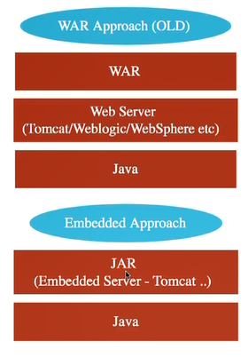

# Spring Boot Basics 

## Chapter One: What is Spring Boot

spring boot is just a wrapper around spring and spring MVC
1) Mark your controller class with @RestController and your API methods with @RequestMapping like so:

```java
import org.springframework.web.bind.annotation.RequestMapping;
import org.springframework.web.bind.annotation.RestController;
@RestController
public class NewsController {
    @RequestMapping("/getAllNewsSrouce")
    public List<NewsSource> getAllNewsSource(){
        ...
    }
}
```

2) Spring boot was built to make coding <b>Faster</b> and <b>Production Ready</b>

2.1) Faster via:
- Spring Initializr
- Spring Boot Starter
- Spring Boot Autoconfig
- Spring Boot DevTools (brings auto-rebuild)

2.2) Production Ready via:
- Logging
- Profiling (diff env config): create application-xxx.properties files and in the main application.properties set 
```java
spring.profile.active=xxx
``` 
- Monitoring

3) log levels from most to least:
 - trace
 - debug
 - info
 - warning
 - error
 - off

4) read config values from application.properties
first, put your values in the file with this format: my-unique-prefix.keyname
```java
my-server-config.apikey=somevalue
```
then annotate a component class with @ConfigurationProperties(prefix=my-unique-prefix) and fields with same name as keyname

```java

@ConfigurationProperties(prefix = "my-unique-prefix")
@Component
public class ServerConfig {
    private String keyname;

    public String getKeyname() {
        return keyname;
    }

    public void setKeyname(String keyname) {
        this.keyname = keyname;
    }
}

```

5) How to deploy apps:

5.1) WAR approach (old approach): install java, install webserver (tomcat,jetty,undertow), deploy .war file 

5.2) embedded approach (better approach): install java + jar file that contains tomcat as well. 
```shell
mvn clean install
java -jar xxxxx-0.0.1-SNAPSHOT.jar
```




6) monitoring metrics using Spring Boot Actuator

to get it include artifactId: spring-boot-actuator and navigate to http://yoururl/actuator 


## Chapter Two: JPA & Hibernate

JDBC and  Spring JDBC both require a lot of coding for queries

here is an example of JDBC Spring

```java
@Repository
@Transactional
public class NewsSourceJDBCRepo {
    @Autowired
    private JdbcTemplate jdbcTemplate;

    public void insert(NewsSource ns) {
        String INSERT_QUERY = """
                insert into newssources(id,display_name,url) 
                values (?,?,?)
                """;
        jdbcTemplate.update(INSERT_QUERY, ns.getId(), ns.getDisplayName(), ns.getUrl());
    }
}
```

but Java JPA is smarter and shorter, basically don't write queries at all, instead you are just responsible for the mapping

```java
import jakarta.persistence.Id;

@Entity
public class Row {
    @Id
    private long id;
    @Column(name="a_name")
    private String name;
    
    public setName(String name) {this.name = name;}
    public string getName() {return this.name;}
    public setId(long id) {this.id = id;}
    public long getId() {return this.id;}
    public Row(long id, String name){this.id=id;this.name=name;}
    
}
```

```java
import jakarta.persistence.EntityManager;
import jakarta.transaction.Transactional;
import org.springframework.beans.factory.annotation.Autowired;
import org.springframework.stereotype.Repository;

@Repository
@Transactional
public class RowJPARepo {
    @Autowired
    private EntityManager em;
    
    public Row findById(long id){
        return em.find(Row.class,id);
    }

}
```

7) there is sth even smarter called Spring Data JPA where you can do less

```java
import org.springframework.data.jpa.repository.JpaRepository;

public interface MySpringDataJpa extends JpaRepository<Row, long>{
    
}
```
and then you can just use your interface

```java
import org.springframework.beans.factory.annotation.Autowired;
import org.springframework.stereotype.Repository;

@Repository
public class MyDataRepo {
    @Autowired
    MySpringDataJpa mySpringDataJpa;
    public void doStuff(){
        mySpringDataJpa.findAll();
        mySpringDataJpa.save(new Row(1,"hi"));
    }
}
```
8) JPA is a Jakarta API suit and Hibernate is one its most popular implementations