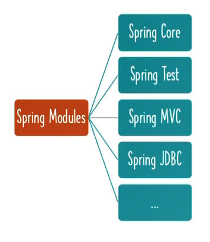
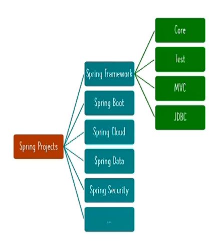
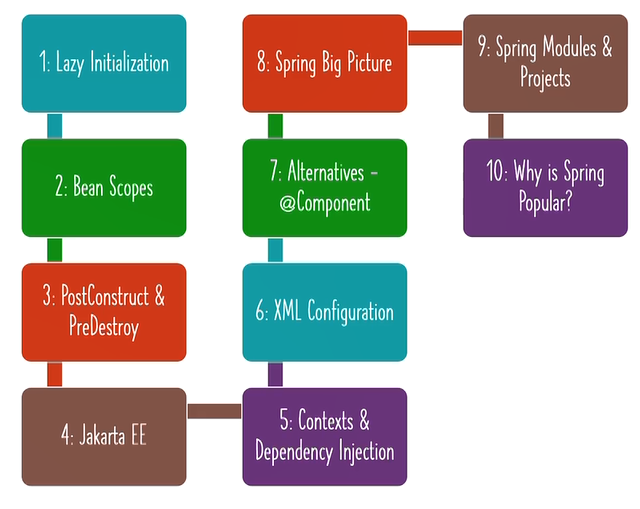

# A refresher on Spring Core & Spring Boot


## Terminology:
**Coupling** <i>Is the measure of how much code change in involved when changing the behavior.  </i><br>
**Tight Coupling:** <i>this is when you don't use frameworks or code into interfaces</i><br>
**Loose Coupling:** <i>code to interface</i><br>
**Dependency Injection:** <i>connecting  @Components using autowiring</i><br>
**Inversion of Control:** <i>creation and wiring is shifted from devs to Spring</i><br>
**Spring Container aka Spring Context aka Spring IOC Container :** <i>Manages Spring Beans and their lifecycle and there are two types: Bean Factory and Application Context</i><br>
**Spring Bean:** <i>any object including primitive data that is managed by Spring framework </i><br>
**Java Bean:** <i>used in sth called EJB where a java class needs to meet 3 criteria 1)public no-arg constructor  2)you should have getters/setters 3)implements serializable</i>
**@AutoWiring:** <i>Used for dependency injection of components (@component) and depending on where it is added, you can have filed or setter or constructor depInj (please refer to #6) </i><br>
**@Component:** <i>allows spring to manage instances of that class when this annotation added before a class </i><br>
**@ComponentScan:** <i>package names to look for potential @Component </i><br>
**@Bean vs @Component:** <i>@component is put on classes vs @Bean that is put on methods in config java file - with @Component java creates object but with @Bean, you have to write a return new class() line </i><br>
**POJO:** any java object is a plain-old-java-object <br>
**Application Context:** <br>


## Chapter One: Basic Concepts 
1) How to define beans:
```java
@Configuration
class SthConfig{
    @Bean 
    public String somename(){return "Bamdad";}

    @Bean (name="Greet")
    public String sayhello(String somename){
        return "Hi " + somename; 
    }
}

```
```java
public class App {
    public static void main() {
        var context = AnnotationConfigApplicationContext(SthConfig.class);
        context.getBean("somename");
        context.getBean("Greet");
    }
}
```

2) how to get the list of all beans
```java

public class App {
    public static void main() {
        var context = AnnotationConfigApplicationContext(SthConfig.class);
        String[] names = context.getBeanDefinitionNames();
    }
}
```

3) putting @primary before a @Bean sets that one as defualt in case there are multiple matching beans

```java
import org.springframework.context.annotation.Primary;

@Configuration
class SthConfig {

    @Bean
    public Game getFirstGame(int id) {
        return new Game("NFS");
    }

    @Bean
    @Primary
    public Game getSecondGame(int id) {
        return new Game("CS Go");
    }
}
```
```java
public class App {
    public static void main(){
        var context = AnnotationConfigApplicationContext(SthConfig.class);
        context.getBean(Game.class); //will get CS Go
    }
}
```

4) you can also have @Qualifier when there are multiple bean option based on your selection

```java
import org.springframework.beans.factory.annotation.Qualifier;
import org.springframework.context.annotation.Bean;

@Configuration
class SthConfig {

    @Bean
    @Primary
    public Game getFirstGame(int id) {
        return new Game("NFS");
    }

    @Bean
    @Qualifier("secondQualifier")
    public Game getSecondGame(int id) {
        return new Game("CS Go");
    }

    @Bean
    public boolean compareGames(GameInfo a,@Qualifier("secondQualifier") GameInfo b){
        System.out.println("comparing a: "+ a.name() + " and b: "+ b.name()); //a is the primary (default) and b is the secondary 
        return a.price()>b.price();
    }
}
```
```java
public class App {
    public static void main(){
        var context = AnnotationConfigApplicationContext(SthConfig.class);
        context.getBean(Game.class); //will get CS Go
    }
}
```
5) you can delegate the creation of classes to spring as well by annotating them as Component

```java
import org.springframework.stereotype.Component;

@Component
public class Game {
    private int rate;
    private String name(){
        return this.name;
    }
    public Game(String name , int rate){
        this.name = name;
        this.rate = rate;
    }
    public int rate(){return this.rate;}
    
}
```

```java
import org.springframework.beans.factory.annotation.Qualifier;
import org.springframework.context.annotation.Bean;
import org.springframework.context.annotation.ComponentScan;

@Configuration
@ComponentScan("package.where.Game.class.is")
class SthConfig {

    @Bean
    @Qualifier('secondGame')
    public Game buildGame(){
        return new Game("diff game",1.3);
    }
    @Bean
    public boolean compareGames(Game a, @Qualifier("secondGame") Game b) {
        System.out.println("comparing a: " + a.name() + " and b: " + b.name()); //a  will be created automatically from @Component and b from the method
        return a.rate() > b.rate();
    }
}
```

6) Spring has 3 types of dependency injections
```java
@Component
public class DependencyOne {
}

@Component
public class DependencyTwo {
}
```
6.1- constructor based: when you don't even need to put @Autowired before the constructor
```java
public class ConstructorDependencyInjection {

    DependencyOne dep1;
    DependencyTwo dep2;

    public ConstructorDependencyInjection(DependencyOne dep1, DependencyTwo dep2) {
        this.dep1 = dep1;
        this.dep2 = dep2;
    }
}
```
6.2- setter based dependency injection where you create methods that only act as setters and put @Autowired before them

```java
import info.bamzy.springcore.examples.basics.games.DependencyOne;

@Component
public class SetterDependencyInjection {

    DependencyOne dep1;
    DependencyTwo dep2;

    @Autowired
    public void setDep2(DependencyTwo two) {
        this.dep2 = two;
    }

    @Autowired
    public void setDep1(DependencyOne one) {
        this.dep1 = one;
    }
}
```
6.3- field based injection which uses injection
```java
@Component
public class FieldDependencyInjection {

    @Autowired
    DependencyOne dep1;
    @Autowired
    DependencyTwo dep2;
}
```

## Chapter Two: Spring Advanced Topics


1) By default, Spring beans are <b><u>eager</u></b> initialized, meaning they are instantiated at the beginning as spring context is being created
you can use @Lazy to change the default behavior. @Lazy is rarely used, only for classes that are not going to be used often<br> In the snippet below, EagerClass is instantiated before PointA while LazyClass gets instantiated at PointB
```java
@Component
@Lazy
public class LazyClass {
    public LazyClass() {
        System.out.println("LazyClass constructor");
    }
}

```
```java

@Component
public class EagerClass {
    public EagerClass() {
        System.out.println("EagerClass constructor");
    }
}
```
```java
@Configuration
@ComponentScan
public class LazyAndEagerLoadingApp {
    public static void main(String[] args){
        var context =new AnnotationConfigApplicationContext(LazyAndEagerLoadingApp.class);
        //PointA
        context.getBean(LazyClass.class);
        //PointB
    }
}

```
<b>Important: </b>you can add @Lazy to both <b>@Bean</b> & <b>@Component</b> and even can be added to <b>@Configuration</b> 

2) Bean Scopes: by default the scope is <u>almost</u> like a java Singleton meaning whenever you ask for an instance of @Bean or @Component, the same instance is returned (per IoC container), and you can use @Scope annotation to change that
```java
@Component
@Scope(value = ConfigurableBeanFactory.SCOPE_PROTOTYPE)
public class PrototypeClass {
}
```
```java
@Component
@Scope(value = ConfigurableBeanFactory.SCOPE_SINGLETON)
public class NormalClass {
}
```
```java
@Configuration
@ComponentScan
public class BeanScopesApp {
    public static void main(String[] args){
        var context =new AnnotationConfigApplicationContext(BeanScopesApp.class);
        System.out.println(context.getBean(PrototypeClass.class)); //diff instance
        System.out.println(context.getBean(PrototypeClass.class)); //diff instance
        System.out.println(context.getBean(PrototypeClass.class)); //diff instance

        System.out.println(context.getBean(NormalClass.class)); //same instance
        System.out.println(context.getBean(NormalClass.class)); //same instance
        System.out.println(context.getBean(NormalClass.class)); //same instance
        
    }
}
```
in spring web context you are going to have more scopes:
2.1) Request: one object instance per each HTTP request
2.2) Session: one object instance throughout a user's web session
2.3) Application: one object instance per web app runtime
2.4) Websocket: one object instance per websocket connection


3) @PostConstruct & @PreDestroy: you can tie extra function to run right after constructor or cleanup right before destructor
```java
@Component
public class ClassWithPostConstructAndPreDestruct {
    SomeDependency sd;
    public ClassWithPostConstructAndPreDestruct(SomeDependency someDependency) {
        super();
        sd = someDependency;
        System.out.println("1.constructor for post construct");
    }
    @PostConstruct
    public void moreSetup(){
        sd.someLogic();
        System.out.println("2.there is more to do");
    }
    @PostConstruct
    public void evenMoreSetup(){
        System.out.println("3.even moooore");

    }

    @PreDestroy
    public void cleanUp(){
        System.out.println("4.cleaning up before dying");
    }

}
```

4) J2EE (1.2,1.3,1.4) -----> Java EE (5,6,7,8) ---> Jakarta EE (currently 10)
Spring 6 and Spring Boot 3 are compatible with Jakarta EE and utilize classes as seen with @PreDestroy & @PostConstruct

- Jakarta EE @Inject === Spring @Autowired
- Jakarta EE @Named === Spring @Component
- Jakarta EE @Qualifier === Spring @Qualifier
- Jakarta EE @Scope === Spring @Scope
so basically the code below works as expected
```java

import jakarta.inject.Inject;
import jakarta.inject.Named;

@Named
public class ClassWithSomeDependency {
    SomeDependency sd;

    public SomeDependency getSd() {
        return sd;
    }
    @Inject
    public void setSd(SomeDependency sd) {
        this.sd = sd;
    }

    public void doLogic() {
        this.sd.someLogic();
    }
}
```
```java

import jakarta.inject.Named;
@Named
@Scope(value = ConfigurableBeanFactory.SCOPE_PROTOTYPE)
public class SomeDependency {
    public void someLogic(){
        System.out.println("logic from dependency");
    }
}

```

5)  Stereotype Annotation :
   - to be more verbose you can use @Service instead of @Component to show the class has business logic 
   - to be more verbose you can use @Controller instead of @Component to show the class is a web controller 
   - to be more verbose you can use @Repository instead of @Component to show the class is deals with data 

## Chapter Three: Spring Boot