# **What you need to know about elasticsearch**
## **how to setup up**

1) make sure docker config has vm.max_map_count=262144 by running
```shell
wsl -d docker-desktop -u root
sysctl -w vm.max_map_count=262144
```
2) setup a docker network (optional)
```shell
docker network create elastic-network
```
3) then run the elasticsearch container
```shell
docker run --name elasticsearch-server --net elastic-network -p 9200:9200 -p 9300:9300 -v d:\workspace\elastic\data:/usr/share/elasticsearch/data -v d:\workspace\elastic\config:/usr/share/elasticsearch/config -e "discovery.type=single-node" -e ES_JAVA_OPTS="-Xms2g -Xmx2g"  -e "xpack.security.enabled=false" elasticsearch:8.7.0


docker run --name elasticsearch-server --net elastic-network -p 9200:9200 -it -e "xpack.security.enabled=false" -e "discovery.type=single-node" docker.elastic.co/elasticsearch/elasticsearch:8.7.0
```

4) copy related info from the log and run the kibana container
```shell
docker run --name kibana-server --net elastic-network -p 5601:5601 docker.elastic.co/kibana/kibana:8.7.0
```


# **basic concepts**

images below are extracted from [this](https://www.udemy.com/course/elasticsearch-complete-guide/) fantastic udemy course by Bo Anderson 


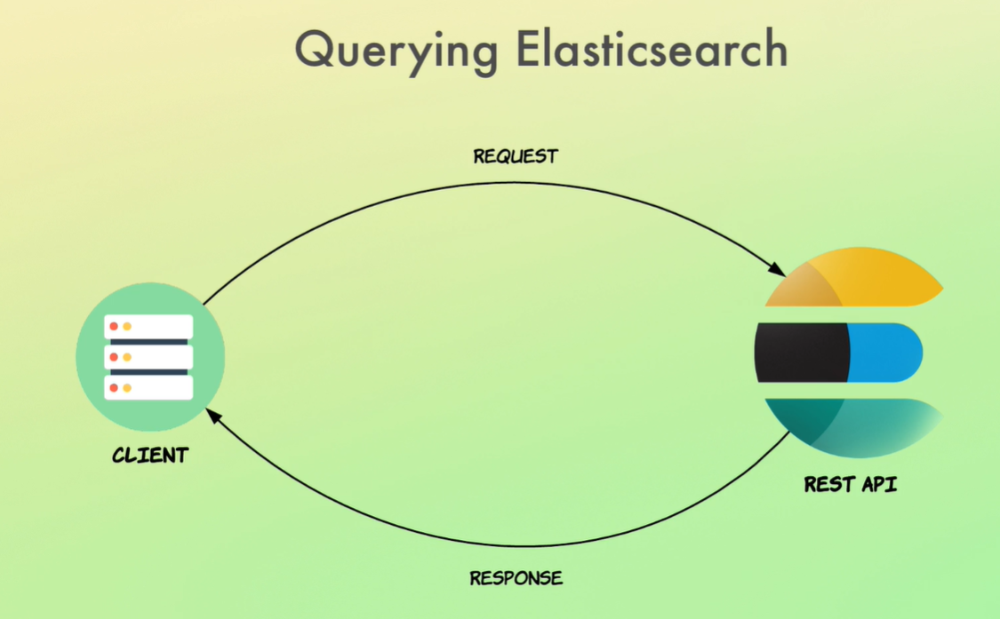
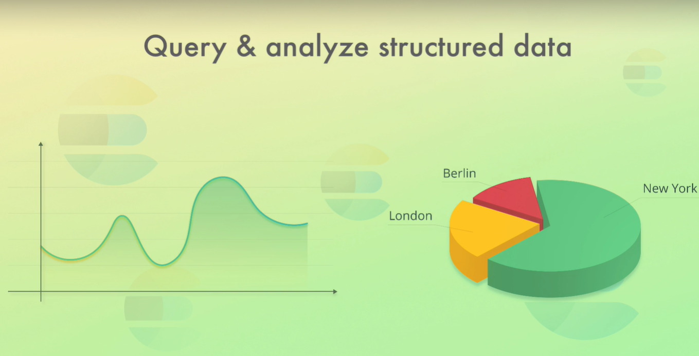

* use cases
  * Query data/document
  * Aggregate Data
  * Application Performance Management (APM): analyze app logs and system metrics
  * Forecast future values with machine learning
  * Anomaly Detection

* indexes are the equivalent of tables in relational database
* data is stored as documents ~~ row in relation database
* a document then contains fields ~~ column in table
* documents are stored as json in elasticsearch
* elasticsearch is written in java 
* its de-centralized by nature and easy to scale


* Elastic Stack:
  *   Elasticsearch,
  *   Kibana: UI, visualization dashboard
  *   Logstash: streams application logs to elasticsearch
  *   X-Pack: adds features such as security, OAuth, LDAP, monitoring CPU and RAM, setup Alerts, gen reports, export csv, PDF, allow ML, allows using SQL in elastic
  *   Beats: this is a collection of agents (data shippers) that send logs and status to Logstash and are installed on monitored servers, FileBeat, MetricBeat, PacketBeat, WinLogBeat

* ELK Stack (from olden times): Elasticsearch, LogStash, Kibana
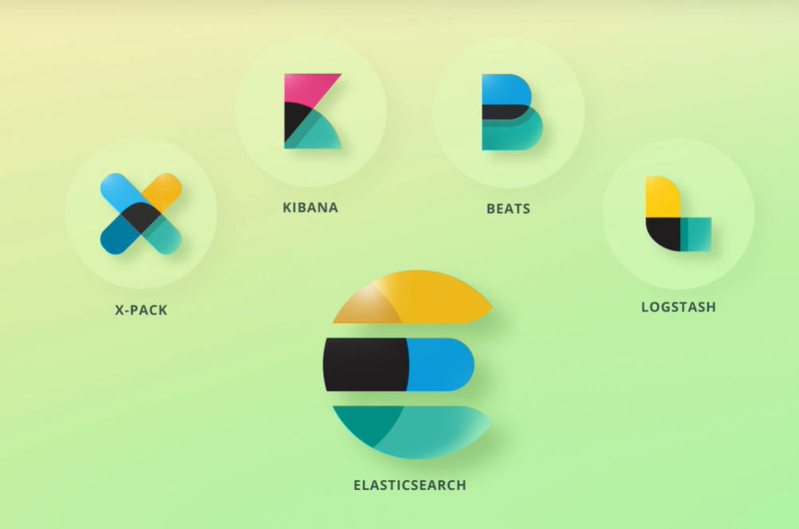
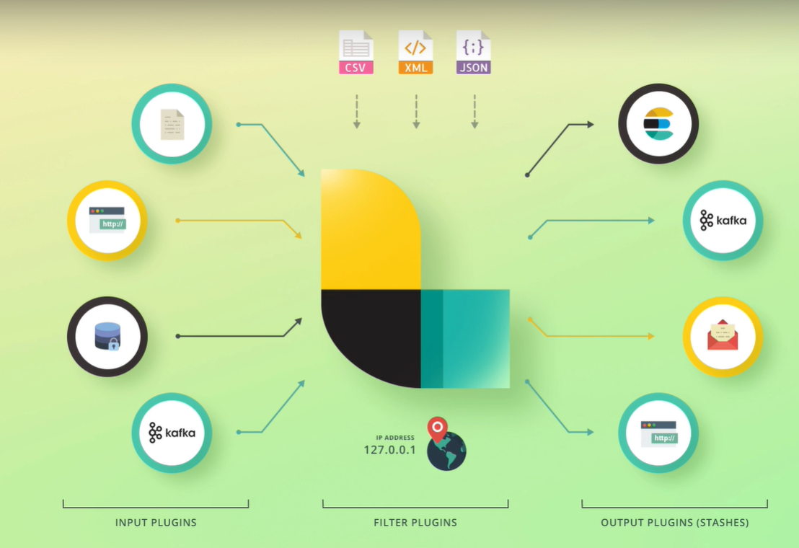
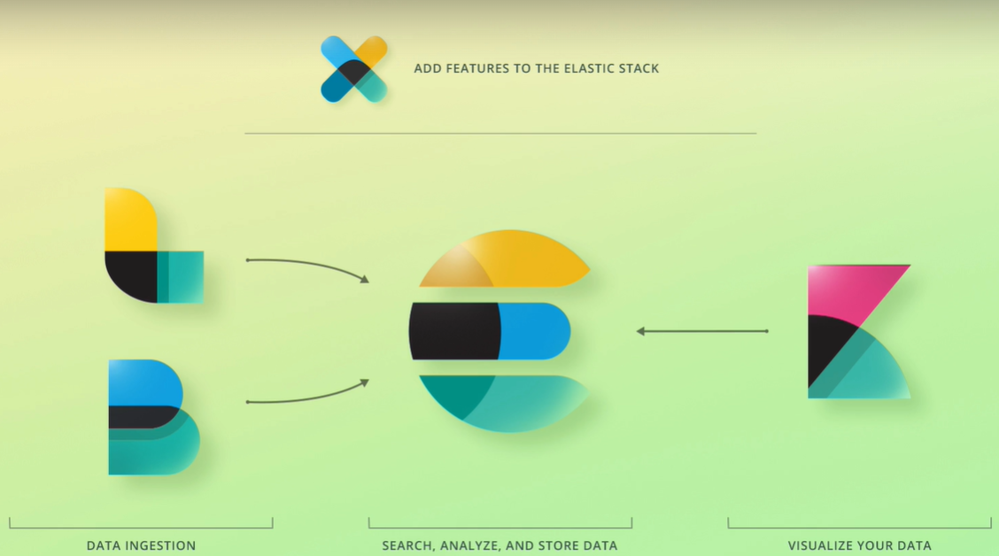


* if you have multi-node elastic, each node will contain some of data. all nodes with related data constitute a cluster. Cross cluster data retrieval is not common
* In a single-node config, your node is still part of a cluster. All nodes are part of a cluster 

* this is how your JSON data is stored as a "document" in a node:
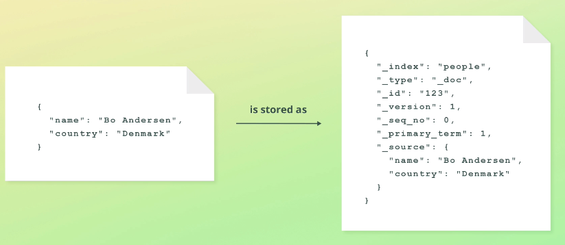

* every "document" is part of an index
* documents within an index have similar structures
* there is no limit on the size of index as long as it is below 2billion!! in each shard


*  **Sharding**
* elasticsearch shards the data when there are more than one node in the cluster
* sharding is happening at the index level no cluster level
* distribute queries to be faster
* more data can be stored because of 2billion limit
* you can split index into shards or shrink shards of an index which will result in creating a new index


*  **Replication**
*  replication happens at the index level
*  replication creates exact full copies of each shard
*  a shard that has been replicated is called the primary shard
*  a primary shard + all its replicas === replication group
*  replica shards are never stored on the same node
*  replication can only happen when you have more than one node

* **Snapshots**
* snapshots are good as daily backups or for moving data or disaster reversion 
  
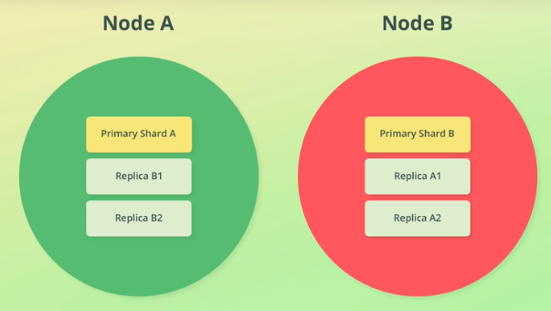


* **Type of nodes (one node can be more than one)**
* Master (m): a node responsible for creating or deleting indexes, but more than one node can have this responsibility while only one of them can BE the master
* master can be elected by voting or specified explicitly in the case of large clusters
* In big clusters, master node should pref not be a data to remain more available for its core tasks
* Data (d): stored data
* Ingest (i): runs ingest pipelines which is the process needed to be done on document before being added to an index. eg. apache access log files go through ingest so IP transformed to lat and long coordinates.
* Machine Learning: runs ML code
* Coordination Node:
* Voting Node: 
## useful commands to use in Kibana's Console
```shell
#this returns cluster name and status and version 
#in this example _cluster is the API and 'health' is the command
GET _cluster/health
{
  "query": {
    "match_all": {}
  }
}
# get node status
GET _cat/nodes?v

#get list of user indexes + system indexes and their size
GET _cat/indices

#create a new index
PUT /posts

#delete an index
DELETE /posts

#create a more complex index
PUT /posts 
{
  "settings" : {
    "number_of_shards":2,
    "number_of_replicas": 2
  }
}

#Insert to posts and if ID is not specified, its auto-generated
POST /posts/_doc 
{
  "name": "bamdad"
}

#search by ID=100 
GET /posts/_doc/100

#update by ID
POST /posts/_update/100
{
  "doc": {"name":"bamzy"}
}

#this is called a scripted update with params which is optional
POST /posts/_update/1 
{
    "script" : {
        "source":"ctx._source.name=params.prefix  + ctx._source.name  "
        "params" : {
            "prefix": "Mr. "
        }
    }
} 

#Upsert: conditionally either insert or update. In below example, if ID 101 does not exist, a new document with upsert object 
POST /posts/_update/101
{
    "script" : {
        "source":"ctx._source.name=params.prefix  + ctx._source.name  "
        "params" : {
            "prefix": "Mr. "
        }
    }
    "upsert" : {
        "name": "new name"
    }
} 

#This is how to delete documents
DELETE /posts/_doc/1


#Multi-row update, IMPORTANT: such updates are not transactional
POST /posts/_update_by_query
{
  "script": {
    "source": "ctx._source.name +=|",
    "query": {
      "match_all" : {}
    }
  }
}

#Multi-row delete
POST /posts/_delete_by_query
{
  "query": {
    "match_all" : {}
  }
}

#using bulk create/index (index == create), Note: this is not transactional
POST /_bulk 
{ "index": {"_index":"posts","_id":200}}
{ "name" : "Ali", "title": "Mr."}
{ "create": {"_index":"posts","_id":201}}
{ "name" : "Reza", "title": "Mr."}

#using bulk update/delete, Note: this is not transactional
POST /_bulk 
{ "update": {"_index":"posts","_id":200}}
{ "doc" : { "name" : "Alireza", "title": "Ms." } }
{ "delete": {"_index":"posts","_id":201}}


``` 

* elastic documents are immutable aka update == delete + add with the same ID, in other words there is no changing a document

## **Routing**
* Routing is the process of finding the correct shard where the document is stored/read
* This is the default routing formula in elastic
* by default the _id is using for the value of _routing


* this is how elastic reads data
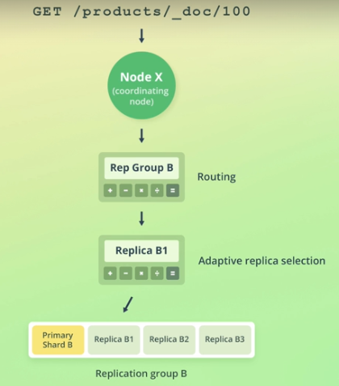

* this is how elastic writes data (note: it always goes to primary shard)
* replication into replica shards is NOT part of the transaction
* _version field only tells you how many time a document has been touched, but there is no revision history in elasticsearch
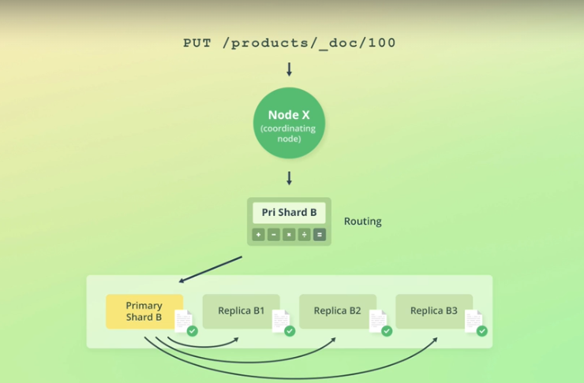


## useful CURL commands
```shell
# it will ask you for your password once you hit enter
curl --insecure -XGET -u bamzy-info-elastic https://kibana.bamzy.info


#this is a working curl query to retrieve all from kibana_sample_data_logs index
curl --insecure -XGET -u bamzy-info-elastic -H "Content-type:application/json" https://kibana.bamzy.info/kibana_sample_data_logs/_search -d "{ \"query\": { \"match_all\": { } } }" 


#curl to  bulk index
curl --insecure -XPOST -u bamzy-info-elastic -H "Content-type:application/x-ndjson" https://kibana.bamzy.info/products/_bulk --data-binary "@products-bulk.json" 

```

## **Text Analysis**
* Store text in a data structure that is easy to search on 
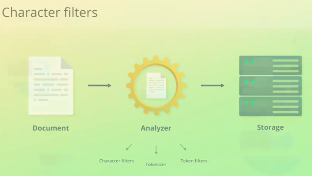

* This is what happens inside a typical analyzer:
  *  It has one tokenizer that breaks down the text into smaller units like words
  *  Token filter: it works on the tokens from above and transforms each one

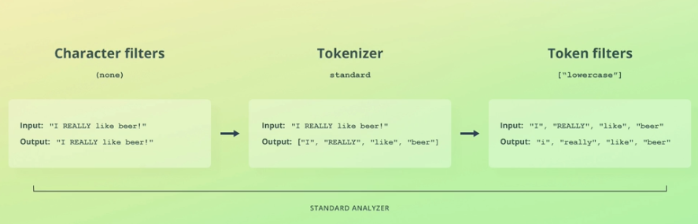


* elastic uses an inverted index data structure which makes it super easy to search for words across multiple documents
* Inverted indexes are build for EACH text field in document
* Other field types like numeric, date and coordinate use BKD trees
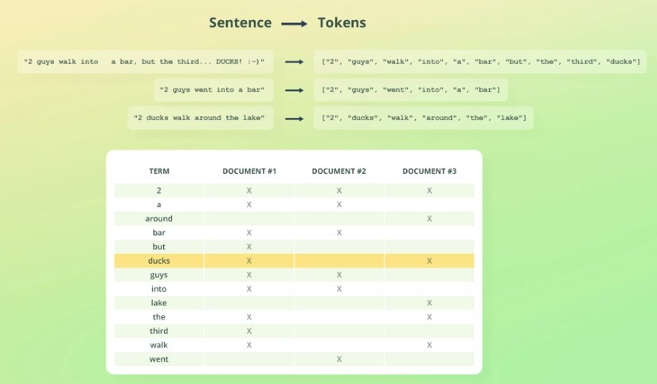


## **Mapping**
* Defines the structure of document fields and their data type
* elasticsearch data types: object, integer, long, boolean, text, double, short, date, float, IP, coordinates
* a mapping dictates how fields will be stored

```shell
# this explicitly defines a map on an index called news
PUT /news 
{
  "mappings": {
    "properties": {
      "post_id": {"type":"integer"},
      "content": {"type":"text"},
      "rating": {"type":"float"},
      "author" : {
        "properties":{
          "first_name": {"type":"text"},
          "last_name": {"type":"text"},
          "email": {"type":"keyword"}
        }
      }
    }
  }
}
# now you can insert your first document with a query like this:
PUT /news/_doc/1
{
  "post_id":7,
  "content":"this is some news",
  "rating": 4.555550000000342342123123,
  "author": {
    "first_name": "bamdad",
    "last_name": "kordi",
    "email": "a@b.c"
    }
  }
}
#but if your input document field does not match and is not coercible like the one below, then you'll get an error
PUT /news/_doc/1
{
  "post_id":7,
  "content":"this is some news",
  "rating": 4.555550000000342342123123,
  "author": {
    "first_name": "bamdad",
    "last_name": "kordi",
    "email": {"name": "a@b.c"}
    }
  }
}


#you can retrieve thw whole mapping for your index by running this
GET /news/_mapping

#or you can be more granular and get mapping for specific fields
GET /news/_mapping/field/author.email
#or
GET /news/_mapping/field/content


#the mapping created earlier can be simplified using dot notation as well
PUT /news2 
{
  "mappings": {
    "properties": {
      "post_id": {"type":"integer"},
      "content": {"type":"text"},
      "rating": {"type":"float"},
      "author.first_name": {"type":"text"},
      "author.last_name": {"type":"text"},
      "author.email": {"type":"keyword"}
    }
  }
}

#you can later add mapping for indexes that already have data
PUT /news/_mapping 
{
  "properties": {
    "created_at": {"type":"date"}
  }
}

#BUT you can NOT update/delete existing mappings because the data might be already indexed based on the mapping. However  you can always do re-index like this
POST /_reindex
{
  "source" : {
    "index": "news"
  },
  "dest" : {
    "index": "news2"
  },
  "script" : """
    if(ctx._source.post_id != null ){
      ctx._source.post_id = ctx._source.post_id.toString();
    }
  """
}

#you can also define index templates meaning its a mapping template for all the future indexes that are not created yet but will apply to them if their name matches a pattern for example:

PUT /_template/news-temp
{
  "index_patterns": ['news-daily-*'],
  "settings": {
    "number_of_shards":2,
    "index.mapping.coerce":false
  }
  "mappings": {
    "properties" : {
      "timestamp": {"type":"date"},
      "name" : {"type": "text"}
    }
  }
}
```

## **Using analyzer API**
```shell

#this will break down text into array of tokens with info about each token
POST /_analyze
{
  "text" :"bamdad is not funny",
  "analyzer": "standard"
}

#the standard analyzer above is the equivalent of API call below
POST /_analyze 
{
  "text": "bamdad is not funny",
  "char_filter" : [],
  "tokenizer": "standard",
  "filter" : ["lowercase"]
}
```


## **Stemming**
* attempting to find the root of a word for example turning Drinking to Drink
  
## **Stop Words**
* useless words such as: at, in, the, or, for that are usually skipped

```shell
#Defining the custom analyzer for persian language to be used in my Iran News Monitor project

PUT /iran_news_monitor
{
  "settings": {
    "analysis": {
      "char_filter": {
        "zero_width_spaces": {
            "type":       "mapping",
            "mappings": [ "\\u200C=>\\u0020"] 
        }
      },
      "filter": {
        "persian_stop": {
          "type":       "stop",
          "stopwords":  "_persian_" 
        }
      },
      "analyzer": {
        "bamzy_persian_analyzer": {
          "tokenizer":     "standard",
          "char_filter": [ "zero_width_spaces","html_strip" ],
          "filter": [
            "lowercase",
            "decimal_digit",
            "arabic_normalization",
            "persian_normalization",
            "persian_stop"
          ]
        }
      }
    }
  },
  "mappings": {
    "properties": {
      "post_id": {"type":"keyword"},
      "content": {"type":"text","analyzer": "bamzy_persian_analyzer"},
      "source_name": {"type":"keyword"},
      "fetch_date": {"type":"date"},
      "initiator" : {
        "properties":{
          "email": {"type":"keyword"}
        }
      }
    }
  }
}


# you can run this to test it
POST /iran_news_monitor/_analyze 
{
  "analyzer": "bamzy_persian_analyzer",
  "text": " که تجمعات اعتراض کارگران به افزایش ۲۷ درصدی دستمزد آنها در سال جدید در گوشه و کنار کشور ادامه دارد، نامه درخواست لغو این مصوبه با نزدیک به ۲۰ هزار امضا به دفتر ریاست جمهوری ارسال شده است."
}

#this is how you close  and open an index for changes such as adding/updating analyzers, otherwise you will get an error
PUT /iran_news_monitor/_close
PUT /iran_news_monitor/_open
```

# **term Search**

```shell

#the simplest search of all time on an index called: product
GET /products/_search 
{
  "query" : {
    "match_all":{}
  }
}

#term level query: this is similar to where clause in the sense that you are looking for exact values and makes sense only for data types such as keyword, integer, long, float. Don't use it on text fields. Eg: this looks for lowercase nike brand and there is no partial match
GET /products/_search
{
  "query": {
    "term": {
      "brand.keyword" = "nike"
    }
  }
}

# search for exact but multi-terms
GET /products/_search
{
  "query": {
    "term": {
      "brand.keyword" = ["nike","adidas"]
    }
  }
}

#search by doc ID
GET /products/_search 
{
  "query": {
    "ids": {
      "values" : [100,200]
    }
  }
}

#search within ranges
GET /products/_search 
{
  "query": {
    "range" : {
      "in_stock" : {
        "gte": 1,
        "lte" 5
      },
      "rate" : {
        "gt" : 4.5
      }
    }
  }
}


#there is term search query only based on prefix:
GET /products/_search
{
  "query": {
    "prefix": {
      "name.keyword" : {
        "value": "Past"
      }
    }
  }
}

#using wildcards is still an example of term query. These are the two wildcards available 
#   (*) matches zero to multiple characters
#   (?) matches exactly one character
# Note: do NOT put wildcards at the begninning of 
GET /products/_search
{
  "query": {
    "wildcard": {
      "name.keyword" : {
        "value": "P?ast*"
      }
    }
  }
}

# you also have regex!!
GET /products/_search
{
  "query" : {
    "regexp" : {
      "tags.keyword" : {
        "value": "Bee(r|f)+"
      }      
    }
  }
}

#you can also search by existence of a field
GET /products/_search {
  "query" : {
    "exists": {
      "field": "tags"
    }
  }
}
```


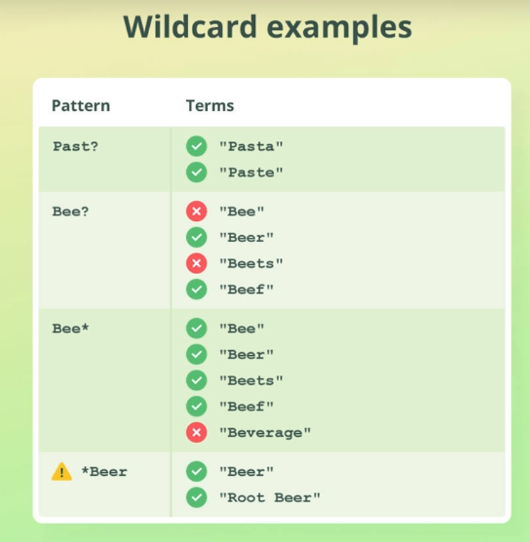
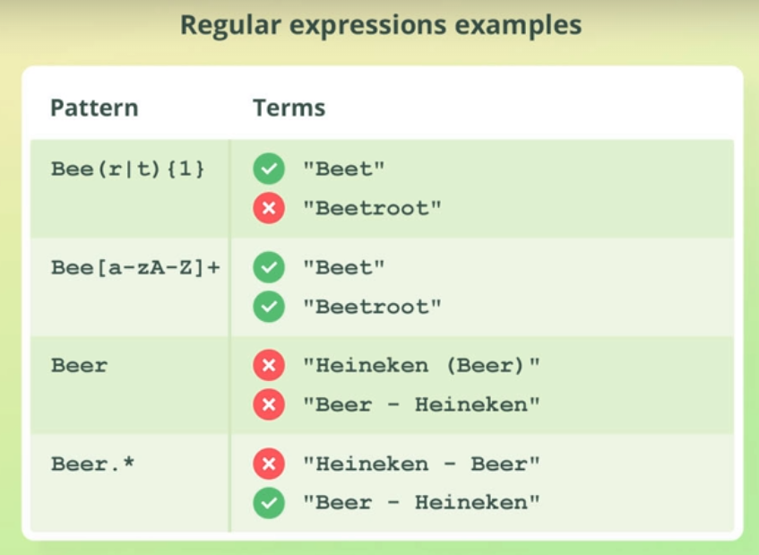
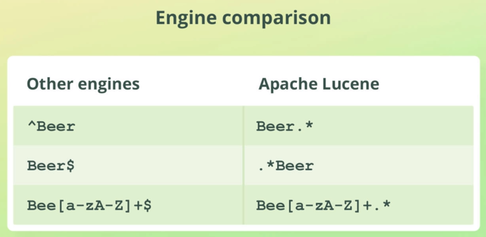


# **Finally the Full Text Search**
```shell
# a typical match query that looks for each words and is not case sensitive 
GET /products/_search
{
  "query": {
    "match" : {
      "name": "pasta chicken"
    }
  },
  "fields": ["name"],
  "_source": "false",
}
```
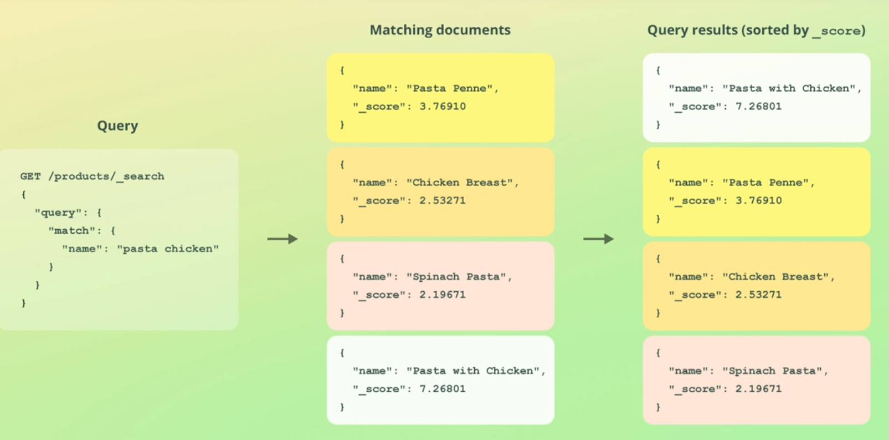

```shell

#you can make elastic to look for both terms
GET /products/_search
{
  "query": 
  {
    "match" : 
    {
      "name": 
      {
        "query" : "pasta chicken",
        "operator" "and"
      }
    }
  },
  "fields": ["name"],
  "_source": "false"
}

# how to search on multiple field
GET /products/_search 
{
  "query" : {
    "multi_match" : {
      "query": "vegetable",
      "fields": ["name","description"]
    }
  }
}
```
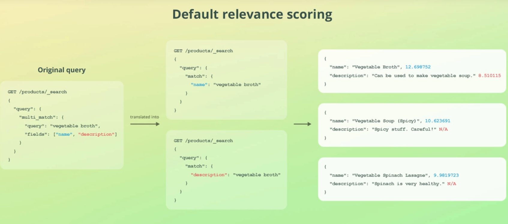


```shell
#if you want the order of words to matter you should use phrase match. Also adjacency matters with matching phrases and extra words in between the words of your phrase would cause mismatch
GET /products/_search
{
  "query" : {
    "match_phrase" : {
      "description" : "complete guide to life"
    }
  }
}
```
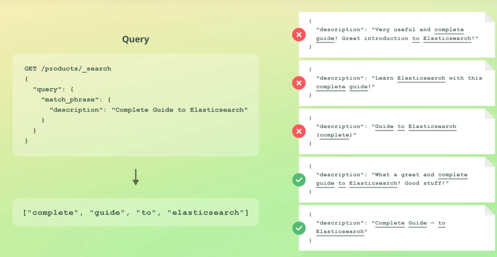
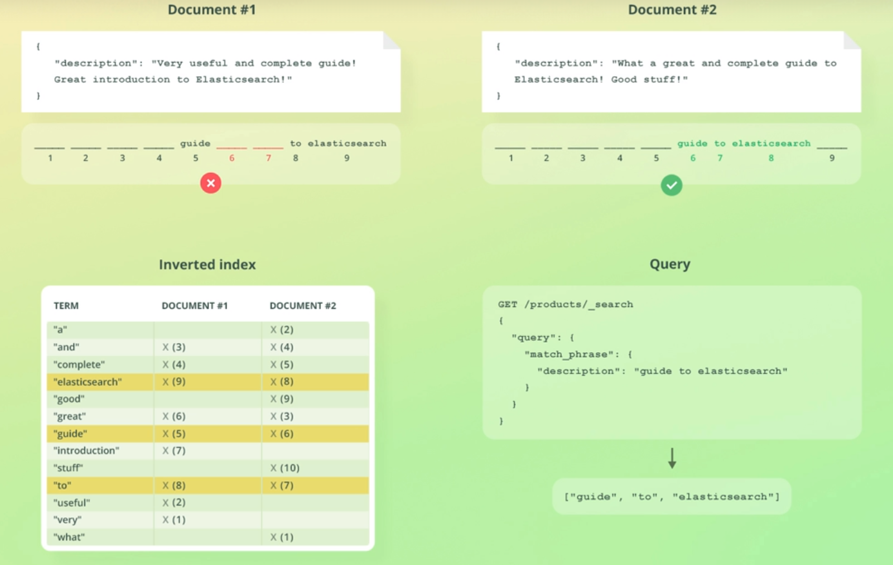


