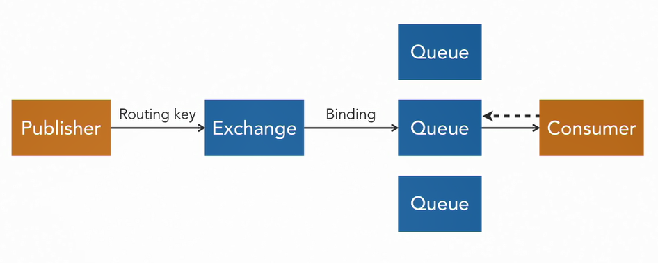
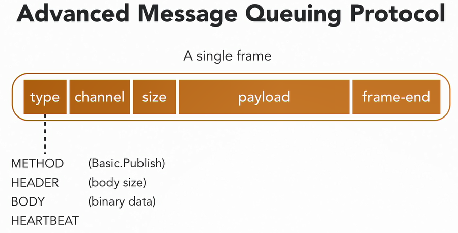
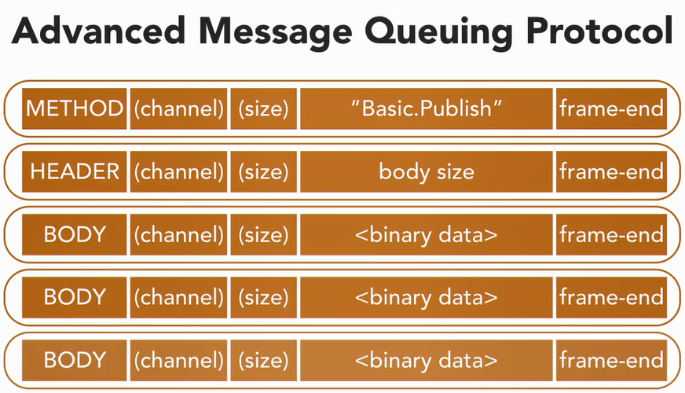

# **What you need to know about RabbitMQ**
## **How to setup up server:**


1) setup a docker network (optional)
```shell
docker network create rabbitmq-network
```
2) then run the rabbitmq-manager container
```shell
docker run -d --hostname rabbitmq-host1 --name rabbitmq-server --net rabbitmq-network -p 15672:15672 -e RABBITMQ_DEFAULT_USER=admin -e RABBITMQ_DEFAULT_PASS=[yourpassword] rabbitmq:3-management
```


## **Overview:**

## Messaging System Components:



  1. **Message**: the data that needs to be communicated between two apps **{Message = routing info + payload}**
  2. **Channel**
  3. **Producer/Publisher**
  4. **Consumer/Receiver**
  5. **Queue**: usually more than 1 queue. Each has unique ID
  6. **Message Broker**: is the intermediary that delivers messages from producer to consumer.
  7. **Router/Exchange**: is a part of message broker that decides which queue(s) the message is going to end up at. Decision is made based on routing elements aka exchanges. There are 4 types of exchanges: Direct, Fanout, Topic & Header  
## RabbitMQ Configs:
  1. **Durability vs Persistance**: applies to both Queues AND Exchanges and it means their configuration will survive a server restart. Note: content of a  queue will only survive a restart if they are set for persistance which is different than durability
  2. **Auto-Delete**: you can set a queue to delete itself when there is no subscriber to it
## AMQP Messaging Protocol


* there are 3 types of message frames that can be involved in building the communication involved in sending a message: METHOD, HEADER, BODY. A HEARTBEAT message is not part of the message but is communicated when channel is idle.  

