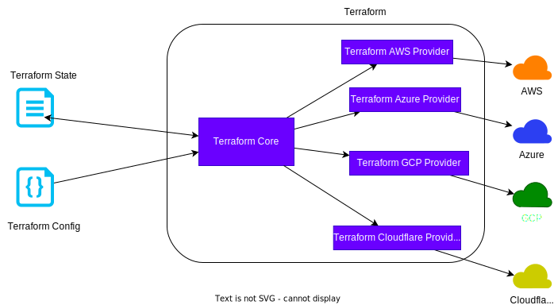

# My Terraform Guide

## History

### Categories of Infrastructure as Code tool
1. Ad hoc scripts: writing proprietary shell script
2. Configuration Management Tools: Puppet, Ansible, Chief mainly for on-premise setup
3. Server Templating  Tools: VMware vm template builders
4. Orchestration Tools: Kubernetes
5. Provisioning Tools: it setup resources in the cloud which is the zero step in cloud like **Terraform**


1) Terraform is cloud agnostic and is compatible with most cloud providers


2 ) important commands:

```bash
terraform init
terraform validate
terraform plan
terraform apply
terraform destroy
```

3) you can have remote backend for collaboration and public visibility for webhooks. 
   
   3.1) Hashicorp has free cloud service to store state files while reading config file from git
   ```yaml
   terraform {
        backend: "remote" {
            organization = "terraform cloud org name"
            workspace = "my-workspace"
        }
   }
   ```

   3.2) you can use S3 bucket plus DynamoDB to act as your backend
   ```yaml
   terraform {
        backend: "s3" {
            bucket = "bucket-name"
            key = "mykey"
            dynamodb_table = "terraoform-table"
            encrypt = "true"
        }
   }
   ```